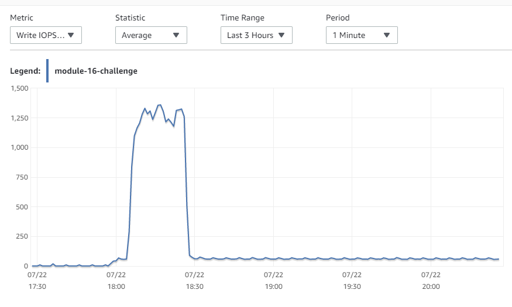
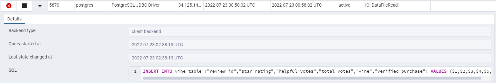
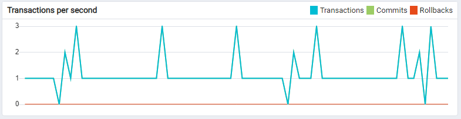
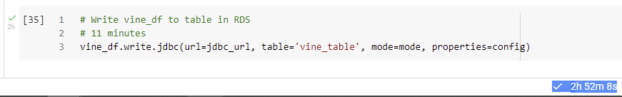

# Amazon Vine Analysis

## Overview

We want to conduct an analysis of reviews in the Amazon Vine program to determine whether or not there is any bias toward favorable reviews from (paid) Vine members. (Paid members are required to write reviews.)

## Software

The analysis made use of the following software:
- Google Colab
- Spark—PySpark dialect
- Amazon Web Services (AWS)
  - Relational Database Service (RDS)—PostgreSQL dialect
  - Simple Storage Service (S3)
- pgAdmin 4

## Analysis

The analysis began by extracting data[^source_data] from an S3 bucket into a PySpark dataframe. The data was then transformed, split, and aggregated into four derivative dataframes (see below), each of which was then uploaded to a PostgreSQL database hosted on an AWS RDS instance.

[^source_data]: https://s3.amazonaws.com/amazon-reviews-pds/tsv/amazon_reviews_us_Books_v1_00.tsv.gz

The names of the Spark dataframes and their corresponding PostgreSQL table names and row counts (which were—as expected—the same for both the dataframes and the tables) were as follows:

| Spark dataframe | PostgreSQL table  | row count  |
| ---             | ---               | --:        |
| `review_id_df`  | `review_id_table` | 10,319,090 |
| `products_df`   | `products_table`  |  2,274,543 |
| `customers_df`  | `customers_table` |  4,632,497 |
| `vine_df`       | `vine_table`      | 10,319,090 |

Primary analysis was then performed on `vine_table`.

### Complications

The estimated upload time for each dataframe to its corresponding table was approximately eleven minutes. This turned out to be a phenomenal underestimation!

Uploading `review_id_df` took approximately an hour and a half; `products_df` and `customers_df` each took almost an hour. The upload of `vine_df`, though, almost did not happen at all.

Several attempts were made to upload `vine_df`. The first two were aborted after they each failed to complete after approximately two hours. The third was left to run overnight and was still seemingly in-process the following morning. It eventually failed when the Google Colab runtime process that was handling the upload shut down due to inactivity.

The fourth attempt did eventually succeed, but not without some strange behavior.

From all indications, the actual upload process took approximately half an hour, according to an examination of write operations per second provided by AWS RDS monitoring, but the process then went into some kind of low-activity state for quite some time after that, as shown here:



During the low-activity period, the pgAdmin Dashboard did show that the connection (via a JDBC driver) was active:



It also showed that there was a very low level of write activity—approximately three transactions per second, intermittently:



The upload attempt finally completed after 2 hours, fifty-two minutes, eight seconds:



### Secondary Processing

Once the data had been uploaded to the PostgreSQL database, the data in `vine_table` was further processed to enable the examination of some aggregate results on its data.

## Results

`vine_table` was processed in order to address the following questions:
- For each type of user (Vine vs. non-Vine), how many reviews were there?  
- For each type of user, how many of those reviews had five stars?
- For each type of user, what percentage of reviews had 5 stars?

The results are summarized in the following table  
(with a screenshot of the results as displayed in pgAdmin [here](./images/analysis_table.png)):
| paid_user | 5-star_reviews | total_reviews | 5-star_percentage |
|    :-:    | --:            | --:           | --:               |
|     Y     |          2,031 |         5,012 |             40.52 |
|     N     |         49,967 |       109,297 |             45.72 |

## Summary

The stated goal of the analysis was to determine whether there is any bias *toward* favorable reviews from Vine members (where only 5-star ratings are considered "favorable"). If that were the case, we would expect that Vine members (those showing `Y` in the `paid_user` column) would be more likely to issue 5-star ratings.

A quick glance at the `5-star_percentage` column shows that not to be the case, and thus we do not have sufficient evidence to support the claim that Vine users are more likely issue 5-star ratings.

Is it the case, though, that perhaps Vine members are *less* likely to issue 5-star ratings?

We assigned labels to the two populations and to their corresponding 5-star proportions: Vine members were population 1 with 5-star proportion ***p*<sub>1</sub>**, and non-Vine members were population 2 with 5-star proportion ***p*<sub>2</sub>**.

We then tested the claim that Vine members are less likely to issue 5-star ratings.

We ran the summary data, above, through a [Two Sample Independent Proportions Test Calculator](http://www2.psych.purdue.edu/~gfrancis/calculators/proportion_test_two_sample.shtml) and obtained the following results (screenshot [here](./images/p_vs_p_z-test.png)):

``` markdown
Test summary
Null hypothesis	H0:P1−P2=0	
Alternative hypothesis	Ha:P1−P2< 0
Type I error rate	α=0.01
Sample size for group 1	n1=5012
Sample size for group 2	n2=109297
Sample proportion for group 1	p1=0.4052
Sample proportion for group 2	p2=0.4572
Pooled proportion	p=0.4549
Standard error	sp1−p2=0.007193
Test statistic	z=-7.220608
p value	p=0.000000
Decision	Reject the null hypothesis
Confidence interval critical value	zcv=2.576236
Confidence interval	CI99=(-0.070471, -0.033408)
```

The p-value of the test is zero to at least six decimal places, which would cause a rejection of the null hypothesis ***H*<sub>0</sub>** at any reasonable level of significance.

We therefore conclude that Vine users are indeed biased *against* favorable reviews.

Why might that be the case?

It is possible that, because Vine members are paid for their reviews, they treat the review process more seriously, and are therefore more critical of the products they are reviewing, wishing to provide their readers with unbiased information about the products.

This is only speculation, however, and further data would have to be gathered on the subject to accurately assess their reasons.